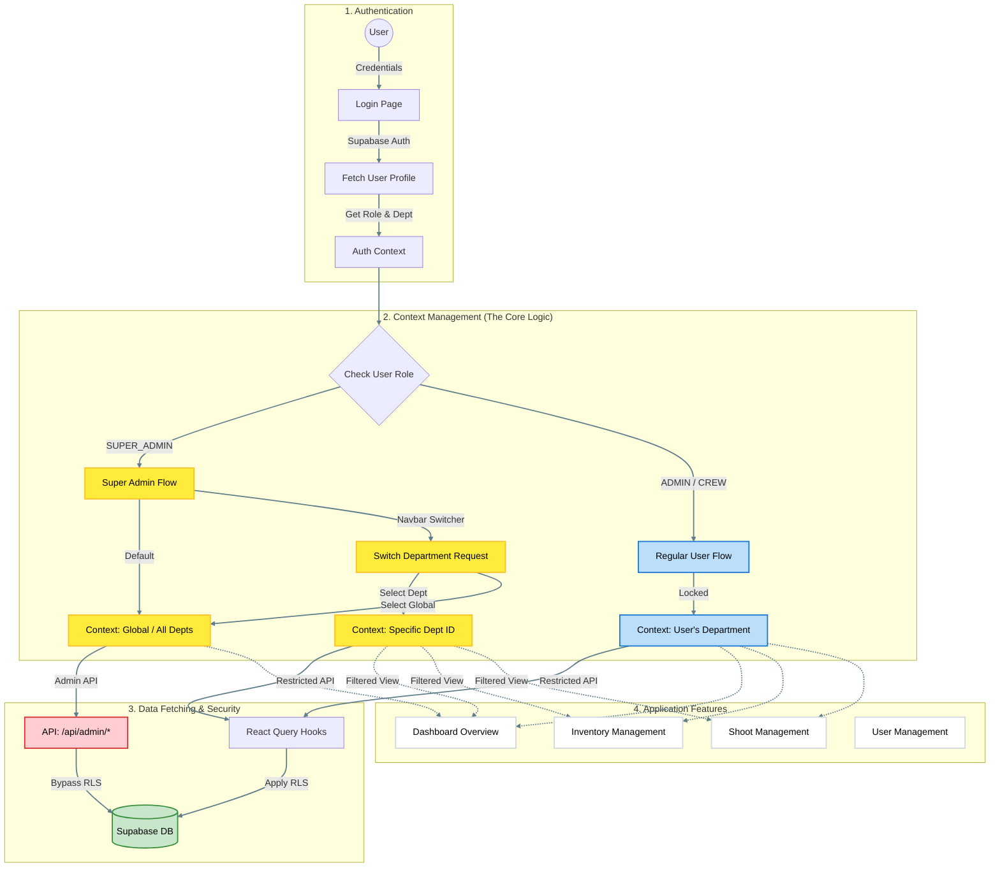

# Application Workflow Diagram

This document outlines the comprehensive workflow of the Production App, detailing user roles, authentication, context switching, and core data flows.

## How to View
This diagram is written in **Mermaid.js**. You can view it visually by:
1.  Using the **Markdown Preview** in VS Code (`Ctrl+Shift+V`).
2.  Viewing this file on **GitHub**.
3.  Pasting the code block above into the [Mermaid Live Editor](https://mermaid.live).
